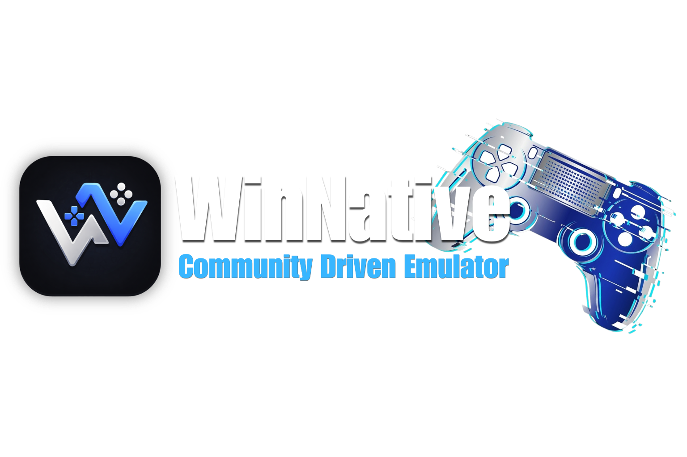

<div align="center">



# Components

**The official component catalogue for the WinNative emulator.**

Graphics translation layers, x86 emulators and Windows compatibility layers —
packaged as installable `.wcp` files and served straight to the app.

</div>

---

## What's inside

| Component | Role | Stable releases |
| :--- | :--- | :--- |
| **DXVK** | Direct3D 8/9/10/11 → Vulkan | [Stable-DXVK](https://github.com/WinNative-Emu/Components/releases/tag/Stable-DXVK) · [ARM64EC](https://github.com/WinNative-Emu/Components/releases/tag/Stable-DXVK-arm64ec) · [Sarek](https://github.com/WinNative-Emu/Components/releases/tag/Stable-DXVK-Sarek) |
| **VKD3D** | Direct3D 12 → Vulkan | [Stable-VKD3D](https://github.com/WinNative-Emu/Components/releases/tag/Stable-VKD3D) · [ARM64EC](https://github.com/WinNative-Emu/Components/releases/tag/Stable-VKD3D-arm64ec) |
| **Box64** | x86_64 → ARM64 emulator | [Stable-Box64](https://github.com/WinNative-Emu/Components/releases/tag/Stable-Box64) |
| **WOWBox64** | WoW64 x86-on-ARM64 thunk layer | [Stable-WOWBox64](https://github.com/WinNative-Emu/Components/releases/tag/Stable-WOWBox64) |
| **FEXCore** | FEX-Emu x86 emulation core | [Stable-FEXCore](https://github.com/WinNative-Emu/Components/releases/tag/Stable-FEXCore) |
| **Proton** | Valve's Wine fork, gaming layers | [Stable-Proton](https://github.com/WinNative-Emu/Components/releases/tag/Stable-Proton) |
| **Wine** | Windows compatibility layers | [Stable-Wine](https://github.com/WinNative-Emu/Components/releases/tag/Stable-Wine) |

Each component folder in this repository carries its own README with the full
variant breakdown.

---

## How it works

Every `.wcp` package is published as a **GitHub Release asset** — nothing binary
is committed to git, so the repository stays small and clones fast.

* `contents.json` — the full catalogue the app reads. Regenerated automatically
  from the published releases by the [Update contents.json](.github/workflows/update-contents.yml)
  workflow whenever a release changes (and once daily as a safety net).
* `default.json` — the curated set installed during first-run setup.
* `.github/workflows/nightly-*.yml` — build the latest upstream sources every
  night and publish them as `*-nightly-*` releases.
* `.github/workflows/weekly-bundle.yml` — packs the newest nightlies into a
  single weekly archive.

Drop a new `.wcp` into a release and the catalogue updates itself.

---

## Repository layout

```
Components/
├── DXVK/  VKD3D/  Box64/  WOWBox64/  FEXCore/  Proton/  Wine/
│         one folder per component (README + local staging area)
├── contents.json          full catalogue consumed by the app
├── default.json           first-run default selection
├── patch/                 build patches applied by the CI workflows
├── tools/                 contents generator + release seeding helper
└── .github/workflows/     nightly builds, weekly bundle, catalogue refresh
```

---

## Maintaining the catalogue

| Task | Command |
| :--- | :--- |
| Rebuild `contents.json` from releases | `python3 tools/generate_contents.py --source releases` |
| Preview `contents.json` from local folders | `python3 tools/generate_contents.py --source local` |
| Publish staged stable packages to releases | `python3 tools/seed-releases.py` |

Nightly builds need no action — they run on a schedule and can also be started
manually from the **Actions** tab.

---

## Credits

The packaged binaries are built from upstream projects and remain under their
original licenses. Thanks to the teams behind them:

[DXVK](https://github.com/doitsujin/dxvk) ·
[dxvk-gplasync](https://gitlab.com/Ph42oN/dxvk-gplasync) ·
[DXVK-Sarek](https://github.com/pythonlover02) ·
[vkd3d-proton](https://github.com/HansKristian-Work/vkd3d-proton) ·
[Box64](https://github.com/ptitSeb/box64) ·
[FEX-Emu](https://github.com/FEX-Emu) ·
[Wine](https://www.winehq.org/) ·
[Proton](https://github.com/ValveSoftware/Proton)

Stable package set originally curated by the Winlator WCP community.

---

<div align="center">
Part of the <strong>WinNative</strong> project — a community-driven emulator.
</div>
